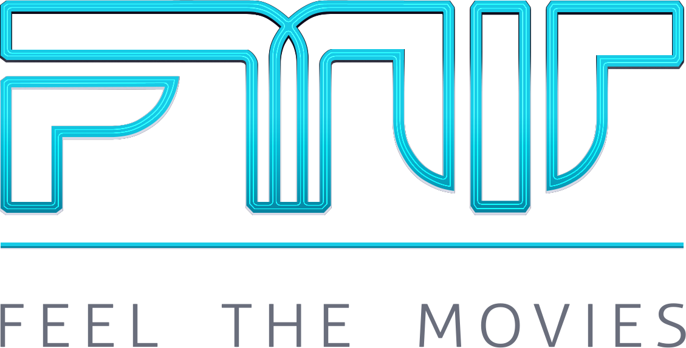

<p align="center"></p>

[](https://dev.azure.com/cyrofarias/feelthemovies/_build/latest?definitionId=1?branchName=master) [](https://coveralls.io/github/cyruzin/feelthemovies?branch=master) [](https://goreportcard.com/report/github.com/cyruzin/feelthemovies) [](https://opensource.org/licenses/MIT)

This is the new API repository for Feel the Movies. Written in Go, totally open source, with test coverage.

This is my first Golang project, so probably there's a lot to improve. Any kind of help is welcome. I did my best researching the best practices, the best folder structuration and all that I could find. In the future, I pretend to bump this project to the version 2.0 using advanced concepts, like design patterns.

## Installation

Make sure that you have Docker installed and then run the following commands:

```sh
$ docker compose up -d
$ go get -t -v ./... 
```

That's it! Go to folder "cmd/feelthemovies" and run the command:

```sh
$ go run main.go
```

### Tests 

As soon as I finish coding, I'll start the tests :).

### Packages

These are the packages that helped me build this project:

* [gorilla/mux](https://github.com/gorilla/mux) - Package mux implements a request router and dispatcher.
* [go-playground/validator](https://github.com/go-playground/validator) - 
Package validator implements value validations for structs and individual fields based on tags.
* [google/uuid](https://github.com/google/uuid) - 
The uuid package generates and inspects UUIDs based on RFC 4122 and DCE 1.1: Authentication and Security Services.
* [rs/cors](https://github.com/rs/cors) - 
CORS is a net/http handler implementing Cross Origin Resource Sharing W3 specification in Golang.
* [go-sql-driver/mysql](https://github.com/go-sql-driver/mysql) - A MySQL-Driver for Go's database/sql package.

### Useful links

* [golang-standards / project-layout](https://github.com/golang-standards/project-layout) - Standard Go Project Layout.
* [avelino / awesome-go](https://github.com/avelino/awesome-go) - 
A curated list of awesome Go frameworks, libraries and software.
* [insomnia](https://insomnia.rest/download/) - Rest client.

### Contributing

To start contributing, please check [CONTRIBUTING](https://github.com/cyruzin/feelthemovies/blob/master/CONTRIBUTING.md).

### License

MIT